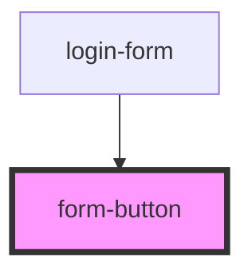

# form-button

Styled HTML button Tag

<!-- Auto Generated Below -->

## Properties

| Property   | Attribute  | Description                    | Type      | Default     |
| ---------- | ---------- | ------------------------------ | --------- | ----------- |
| `disabled` | `disabled` | HTML Button disabled attribute | `boolean` | `false`     |
| `type`     | `type`     | HTML Button type attribute     | `string`  | `undefined` |

## Dependencies

### Used by

 - [login-form](../../../login/login-form)

### Graph

----------------------------------------------

*Built with [StencilJS](https://stenciljs.com/)*
