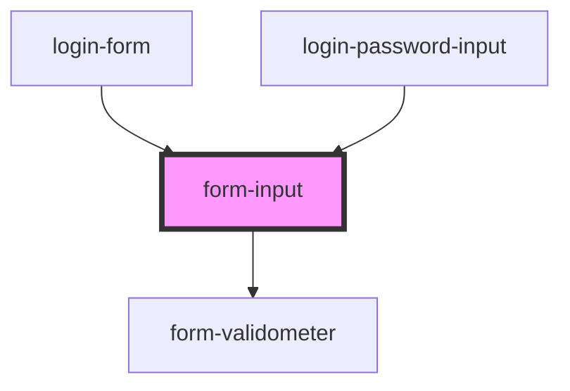

# form-input

<!-- Auto Generated Below -->

## Properties

| Property                       | Attribute                         | Description                                                                                                                                                                                                                                        | Type      | Default     |
| ------------------------------ | --------------------------------- | -------------------------------------------------------------------------------------------------------------------------------------------------------------------------------------------------------------------------------------------------- | --------- | ----------- |
| `label` _(required)_           | `label`                           | HTML Label text                                                                                                                                                                                                                                    | `string`  | `undefined` |
| `name` _(required)_            | `name`                            | HTML Input name attribute                                                                                                                                                                                                                          | `string`  | `undefined` |
| `required`                     | `required`                        | HTML Input required attribute                                                                                                                                                                                                                      | `boolean` | `undefined` |
| `rules`                        | --                                | Array of {test, message} objects defining the functions to validate/invalidate the input. - `message` must contain <mark> element if isValid is defined. - leave `test` undefined if the message is purely descriptive and contains no validation. | `Rule[]`  | `[]`        |
| `type`                         | `type`                            | HTML Input type attribute                                                                                                                                                                                                                          | `string`  | `'text'`    |
| `value`                        | `value`                           | HTML Input value attribute                                                                                                                                                                                                                         | `string`  | `undefined` |
| `vspace`                       | `vspace`                          | Flag to add standard vertical space around the input                                                                                                                                                                                               | `boolean` | `undefined` |
| `withTogglePasswordVisibility` | `with-toggle-password-visibility` | Flag to display the togglePasswordVisibilityIcon                                                                                                                                                                                                   | `boolean` | `undefined` |

## Events

| Event            | Description | Type                                 |
| ---------------- | ----------- | ------------------------------------ |
| `inputValidated` |             | `CustomEvent<inputValidatedPayload>` |

## Dependencies

### Used by

 - [login-form](../../../login/login-form)
 - [login-password-input](../../../login/login-password-input)

### Depends on

- [form-validometer](../form-validometer)

### Graph

----------------------------------------------

*Built with [StencilJS](https://stenciljs.com/)*
