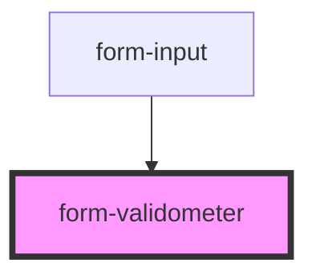

# form-validometer

<!-- Auto Generated Below -->

## Properties

| Property                    | Attribute      | Description                                                                                                                                                                                                                                | Type         | Default     |
| --------------------------- | -------------- | ------------------------------------------------------------------------------------------------------------------------------------------------------------------------------------------------------------------------------------------ | ------------ | ----------- |
| `criteriaList` _(required)_ | --             | Array of {isValid, message} objects describing the valid and invalid criteria. - `message` must contain <mark> element if isValid is defined. - leave `isValid` undefined if the message is purely descriptive and contains no validation. | `Criteria[]` | `undefined` |
| `vspaceSmall`               | `vspace-small` | Flag to add small vertical space above the validometer                                                                                                                                                                                     | `boolean`    | `undefined` |

## Dependencies

### Used by

 - [form-input](../form-input)

### Graph

----------------------------------------------

*Built with [StencilJS](https://stenciljs.com/)*
