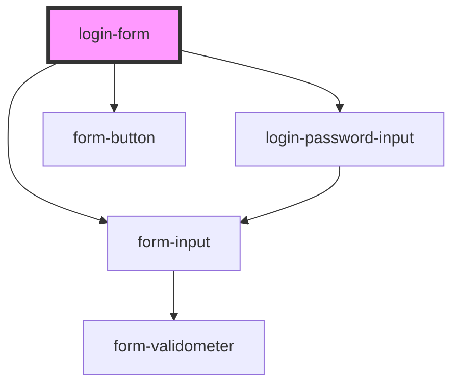

# login-form

<!-- Auto Generated Below -->

## Dependencies

### Depends on

- [form-input](../../commons/form/form-input)
- [login-password-input](../login-password-input)
- [form-button](../../commons/form/form-button)

### Graph

----------------------------------------------

*Built with [StencilJS](https://stenciljs.com/)*
