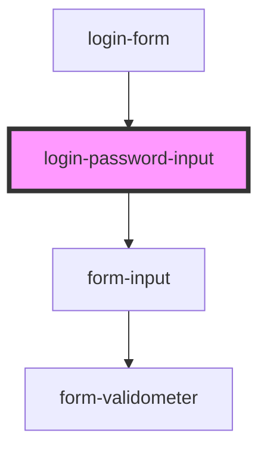

# login-password-input

<!-- Auto Generated Below -->

## Properties

| Property | Attribute | Description                                          | Type      | Default     |
| -------- | --------- | ---------------------------------------------------- | --------- | ----------- |
| `label`  | `label`   | HTML Label text                                      | `string`  | `undefined` |
| `name`   | `name`    | HTML Input name attribute                            | `string`  | `undefined` |
| `vspace` | `vspace`  | Flag to add standard vertical space around the input | `boolean` | `undefined` |

## Dependencies

### Used by

 - [login-form](../login-form)

### Depends on

- [form-input](../../commons/form/form-input)

### Graph

----------------------------------------------

*Built with [StencilJS](https://stenciljs.com/)*
